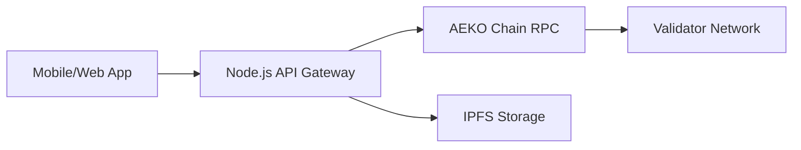

# Aeko Social Integration Overview

**Aeko Social** is the flagship dApp built on AEKO Chain. It demonstrates the full power of the protocol.

## Integration Points

1.  **Identity**: Uses the chain's `Identity Account` for login and profile data.
2.  **Storage**: Uses IPFS for images/videos, but stores the **Content Hash** on-chain.
3.  **Economy**: Uses AEKO Coin for tips, subscriptions, and ad revenue sharing.

## Architecture

