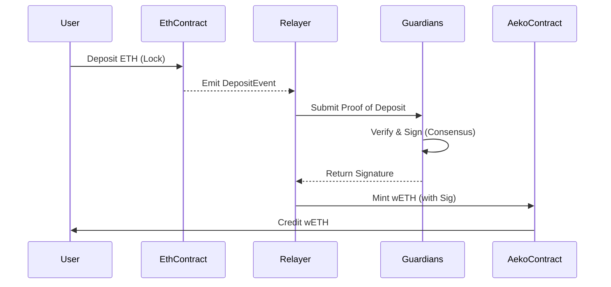

# Bridge Message Flow

How a message travels from Ethereum to AEKO.

## Flow Diagram

## Confirmation Times
*   **Ethereum -> AEKO**: ~15 minutes (Requires 64 Eth blocks for finality).
*   **AEKO -> Ethereum**: ~20 minutes (Optimistic delay for fraud proofs).
